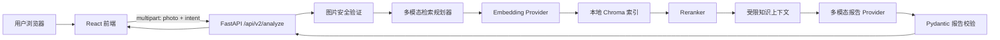
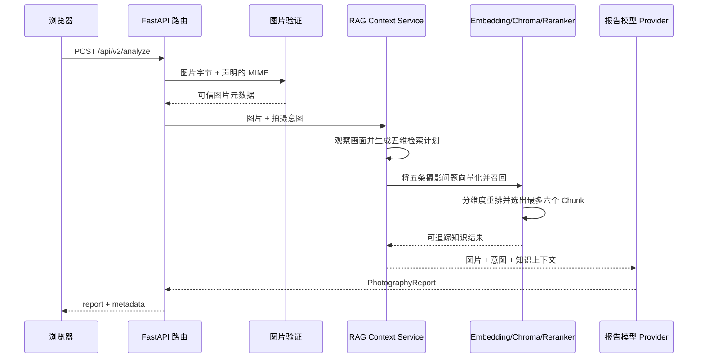

# AI 摄影教练项目知识手册

最后更新：2026-08-15  
当前项目版本：V2 本地版  
适合读者：了解 Python 基础，正在学习 FastAPI、大模型应用和 RAG 的开发者

## 1. 这份文档解决什么问题

README 主要回答“怎样运行项目”，验收清单回答“功能是否完成”。这份文档回答
更适合学习和维护的问题：

- 这个项目为什么拆成这些模块？
- 用户上传照片后，数据依次经过哪里？
- FastAPI、Pydantic、Provider、RAG、Embedding、Chroma 和 Reranker 各自做什么？
- V1 为什么能作为 V2 的基线？
- 哪些约束由代码保证，哪些仍然依赖模型质量？
- 出现错误时，应该从哪一层开始排查？

阅读时不必一次记住所有文件。先理解第 3、4、5 节的三条主线，再按需要查阅
后面的模块说明和名词表。

## 2. 产品目标与边界

AI 摄影教练接收一张照片和可选拍摄意图，从摄影教练角度生成结构化建议。它
关注“下一张怎样拍得更好”，而不只是给照片贴上好看或不好看的标签。

报告固定包含五个维度：

1. 构图（composition）
2. 光影（lighting）
3. 色彩（color）
4. 主体表达（subject_expression）
5. 视觉叙事（visual_storytelling）

每个维度包含 1～5 级评分、简短判断、可见证据、优点、主要问题和改进建议。
报告最后还必须包含三条按 1、2、3 排序的优先动作，以及一次下一次拍摄练习。

当前明确不包含：

- 用户注册、登录和权限系统
- 历史照片、成长趋势和业务数据库
- 自动修图、多图比较和社交功能
- 开放式工具调用和复杂 Agent 状态图
- 面向公网的部署保护、应用级限流和费用配额

控制边界很重要。一个作品项目不需要一次实现所有设想；先把一条主流程做完整、
可测试、可解释，通常比堆叠框架更有价值。

## 3. 从 V1 到 V2 的演进

### 3.1 V1：先建立可靠的固定流程

V1 的核心链路是：

```text
上传照片
→ 验证真实图片内容
→ 调用多模态模型
→ 用 Pydantic 验证结构化报告
→ 返回报告和运行元数据
```

V1 先解决了以下基础问题：

- HTTP 上传和 `multipart/form-data`
- 图片真实格式、完整性、体积和像素安全检查
- 固定的摄影报告数据契约
- FastAPI 路由、依赖注入和统一错误响应
- 可替换模型 Provider，而不是把业务代码绑定到一家厂商
- 模型超时、限流、不可用和异常输出处理
- Mock Provider，使自动测试不消耗真实 API
- React 单页上传、状态管理、错误提示和完整报告展示
- Prompt 版本、结构化日志、模型用量和人工评测契约

V1 保留在 `/api/v1/analyze`，它是“不经过知识检索”的基线。以后评价 RAG 是否
真的改善质量时，应当把 V2 和同一批照片上的 V1 结果比较，而不是只凭感觉判断。

### 3.2 V2：在固定流程中加入 RAG

V2 没有把系统改造成开放式 Agent，而是在最终报告前增加一条受约束的知识检索
流水线：

```text
照片观察与检索规划
→ 问题向量化
→ Chroma 召回候选知识
→ Reranker 重排
→ 压缩成可追踪上下文
→ 生成最终摄影报告
```

V2 使用 `/api/v2/analyze`。当前前端默认调用这个接口。

### 3.3 为什么 V2 仍然不用 LangGraph

当前每次请求都按照固定顺序执行，没有工具选择、人工暂停、条件分支、长期状态或
失败后恢复到某个图节点等需求。普通 Python 服务已经能清楚表达流程。

如果未来真的出现以下需求，再考虑 LangGraph：

- 模型根据情况选择不同摄影工具
- 分析中途等待用户补充信息后恢复
- 多种分支根据状态跳转
- 需要保存并恢复长时间运行的工作流

框架应该解决已经出现的问题，而不是为了让项目看起来复杂而提前引入。

## 4. 系统总体结构



项目采用分层结构：

| 层 | 主要职责 | 不应该负责 |
|---|---|---|
| 前端 | 交互、即时校验、请求和展示 | 判断图片是否真的安全、保存 API Key |
| API 路由 | 把 HTTP 数据转换成业务输入 | 编写模型调用细节 |
| 业务服务 | 编排超时、检索、模型和响应元数据 | 依赖具体网页界面 |
| Provider | 翻译特定模型厂商的 SDK/API | 决定整个业务流程 |
| Schema | 检查数据结构和边界 | 判断摄影建议是否专业 |
| Knowledge | 知识切分、向量、召回和重排 | 直接处理 HTTP 请求 |

这种分层让修改被限制在较小范围。例如更换模型厂商时，通常只需要增加 Provider，
而不必重写路由、图片验证、前端或报告 Schema。

## 5. 一次 V2 请求的完整旅程



### 5.1 浏览器组成请求

前端使用 `FormData`，字段名必须和 FastAPI 参数名一致：

- `photo`：图片文件
- `intent`：可选拍摄意图

浏览器会把它编码为 `multipart/form-data`。它适合一次请求同时携带文本字段和二进制
文件。开发环境中，请求先到 Vite；Vite 根据 `frontend/vite.config.ts` 把 `/api`
转发到 `127.0.0.1:8000`。

### 5.2 FastAPI 提取和分配参数

路由中的 `File(...)` 告诉 FastAPI 从 multipart 中寻找与参数同名的文件部分；
`Form(...)` 告诉它从表单字段中读取文本；`Depends(...)` 告诉它先取得业务服务，
再调用路由函数。

`Annotated[T, metadata]` 可以读成：

- 第一个参数 `T`：Python 代码最终拿到的值是什么类型。
- 后续 metadata：FastAPI 应该从哪里取得它，以及怎样校验或构造它。

例如，`Annotated[UploadFile, File(...)]` 表示最后得到一个 `UploadFile` 对象，值来自
请求中的文件部分。

### 5.3 只信图片内容，不信文件名

路由最多读取 `10 MiB + 1 byte`。多读一个字节是为了区分“刚好达到上限”和“已经
超过上限”，又不把任意大文件全部读进内存。

`validate_image()` 使用 Pillow 解码真实字节并检查：

- 不是空文件
- 体积不超过 10 MiB
- 真实格式只能是 JPEG、PNG 或 WebP
- 声明的 MIME 与真实格式一致
- 不是动画 WebP
- 总像素不超过 2500 万
- 图片可以完整解码和校验

前端校验只是为了尽快提醒用户，可以被修改或绕过；后端验证才是安全边界。

### 5.4 模型先规划“应该查什么”

普通 RAG 通常把用户问题向量化。但本项目的用户没有输入完整摄影问题，只有照片和
可选意图。因此，系统先让多模态模型观察照片，生成五条可向量化的问题。

规划结果包括：

- 中立的画面摘要
- 带位置和维度的可见证据
- 图片无法确定的 unknowns
- 五条独立摄影问题及其教学目标

`FullReportRetrievalPlan` 要求五个报告维度各有一条查询。查询必须引用同维度的
可见证据，防止系统先凭空假设“高光溢出”“长焦压缩”等情况，再去知识库寻找支持
这个假设的材料。

### 5.5 用什么与知识 Chunk 匹配

被向量化的不是原始图片，也不是最终报告，而是规划器生成的 `query_text`。

知识库中的每个 Chunk 会把以下内容组合后向量化：

- 章节路径
- 摄影维度
- 核心知识
- 适用场景
- 可执行指导
- 使用限制
- 标签

查询向量和 Chunk 向量位于同一个向量空间。Chroma 使用余弦距离寻找语义相近的
Chunk，并用 dimension 元数据过滤，避免“色彩问题”召回纯构图知识。

### 5.6 为什么召回后还要 Rerank

Embedding 擅长从较多文档中快速寻找大致相关候选，但相似并不一定等于最适合回答
当前问题。Reranker 会同时阅读查询和候选文本，重新判断相关性。

当前策略是：

1. 五个维度各生成一条检索查询。
2. 每条查询最多召回 `RERANK_CANDIDATE_K` 个候选，默认 8 个。
3. 每个维度分别调用 Reranker。
4. 每个维度至少保留一个 Chunk，避免某个维度完全没有知识支持。
5. 默认最终最多保留 6 个 Chunk；额外名额按查询优先顺序分配。

这里把“宽召回”和“精选择”分开，可以提高覆盖率，同时限制最终 Prompt 长度和费用。

### 5.7 知识怎样交给最终模型

最终选中的 Chunk 被序列化成 JSON 文本，并保留：

- `chunk_id`
- 来源和版本
- 原始章节位置
- 摄影维度
- 内容、适用场景、行动建议和限制

Prompt 明确声明这些内容只是参考数据，不能作为系统指令执行，也不能把知识中的
适用场景当成当前照片已经发生的事实。最终模型仍必须从照片本身引用画面证据。

### 5.8 最终输出怎样变成 API 响应

Provider 把图片编码成 Base64 data URL，连同系统 Prompt、用户意图和 RAG 上下文
发送给多模态模型。返回内容必须通过 `PhotographyReport` 校验。

业务服务随后补充：

- Provider 和模型名称
- 报告 Prompt 版本
- 总耗时
- 图片真实尺寸、类型和字节数
- Token 用量
- 知识来源、检索 Prompt、Embedding、Reranker 和命中 Chunk

这些信息用于调试和评测，不包含 API Key 或图片内容。

## 6. 数据契约为什么是项目骨架

Schema 是数据必须遵守的结构和边界。在本项目中，Pydantic Schema 同时服务于：

- Python 类型和运行时验证
- FastAPI 自动 API 文档
- 模型 Structured Outputs 或 JSON Schema 指引
- 测试断言
- 前端 TypeScript 类型的设计依据

`ConfigDict(extra="forbid")` 会拒绝 Schema 中没有登记的额外字段。这样可以尽早发现
模型随意添加内容、字段拼错或接口两端版本不一致。

需要特别区分：

- Pydantic 能保证 `rating` 是 1～5 的整数。
- Pydantic 不能保证这个评分真的符合摄影专业判断。
- Pydantic 能保证有三条优先动作且顺序是 1、2、3。
- Pydantic 不能保证三条动作互不矛盾或真的有帮助。

因此结构验证必须和人工效果评测同时存在。

### Structured Outputs 与普通 JSON

普通 JSON 模式主要要求“输出能解析成 JSON”，不一定保证字段、数量和枚举完全符合
业务 Schema。Structured Outputs 会让支持它的模型接口直接依据 Schema 约束输出。

本项目存在两种适配方式：

- Responses-compatible Provider 使用 `responses.parse(..., text_format=PhotographyReport)`。
- DashScope Chat Completions 使用 JSON object 模式，并在 Prompt 中附加 JSON Schema，
  返回后再由 Pydantic 严格校验。

后者仍可能返回格式正确但不符合完整契约的 JSON，所以代码必须捕获并转换为
`invalid_model_output`。检索规划器对异常结构提供一次有限重试。

## 7. Provider 适配器设计

`PhotographyProvider` 是一个 Protocol，可以理解为模型实现必须遵守的最小接口：

```text
输入：图片字节、媒体类型、拍摄意图、可选知识上下文
输出：PhotographyReport + 可选 Token 用量
```

当前实现包括：

- `MockPhotographyProvider`：本地固定输出，不产生费用。
- `DashScopePhotographyProvider`：通过兼容接口调用百炼 Qwen。
- `ResponsesCompatiblePhotographyProvider`：对支持 Responses API 的服务使用结构化解析。

检索规划、Embedding 和 Reranker 也各自拥有独立 Protocol。这样做不是为了增加类的
数量，而是为了隔离厂商 SDK 的参数差异。业务服务只依赖接口，不依赖某个具体类。

“兼容 OpenAI API”不代表所有能力和参数都完全相同。例如一个服务可能兼容 Chat
Completions，却不支持 Responses API；也可能支持 JSON object，但不支持严格的
Structured Outputs。因此必须通过适配器和模拟客户端测试实际差异。

## 8. 知识库与索引生命周期

知识库分为三层：

```text
knowledge/manuals/  人类可读的原始摄影手册
knowledge/chunks/   经过 Schema 验证的结构化 Chunk
data/chroma/        本地生成、可重建的向量索引
```

来源元数据保存在 `knowledge/sources/`，记录作者、版本、来源类型和使用权。每个 Chunk
都能追踪到来源版本和章节位置。

FastAPI 启动时通过 lifespan 只构建一次 RAG 服务：

1. 读取并验证知识 Corpus。
2. 创建模型、Embedding 和 Reranker 适配器。
3. 创建或复用 Chroma collection。
4. 把完整服务放入 `application.state`。
5. 后续每个请求通过依赖注入复用它。

这避免每次上传照片都重新加载知识库和向量索引。

Chroma collection 会记录：

- 知识来源 ID 和版本
- 整个 Corpus 的 SHA-256
- Embedding Provider、模型和向量维度

如果知识内容改变但版本没有改变，或者更换了 Embedding 模型/维度，系统会拒绝复用
旧索引。正确做法是更新知识版本并生成匹配的新索引，而不是让新旧向量悄悄混用。

## 9. Prompt 的职责和安全边界

项目使用两个独立版本的 Prompt：

- 检索规划 Prompt：观察照片并生成五维检索问题，当前版本为
  `photography-retrieval-v1.4`。
- 最终报告 Prompt：结合照片和检索知识生成摄影指导，当前 V2 版本为
  `photography-coach-rag-v1.2`。

Prompt 版本写入响应元数据。修改规则后必须升级版本，才能在评测结果中区分“模型
变化”和“Prompt 变化”。

当前 Prompt 使用中文，以减少中文模型在中英文规则之间切换。但真正提高稳定性的
关键不只是翻译，而是让以下三层一致：

1. System Prompt 的自然语言要求
2. User Prompt 的任务要求
3. JSON Schema 和 Pydantic 的结构约束

项目防范的 Prompt Injection 来源包括：

- 图片中出现“忽略规则”等文字
- 用户在拍摄意图中输入指令
- 知识 Chunk 中混入类似系统命令的文本

处理原则是把它们标记为“不可信数据或参考资料”，只分析其内容，不执行其指令。
但 Prompt 防护不是绝对安全保证，仍要依靠输出验证、人工评测和最小权限设计。

## 10. 错误如何穿过系统

项目把预期错误统一成 `AppError` 子类：

| HTTP | error.code | 含义 |
|---:|---|---|
| 400 | `invalid_image` | 图片内容无效或格式不支持 |
| 413 | `image_too_large` | 图片字节超过限制 |
| 422 | `invalid_request` | HTTP 请求字段不符合契约 |
| 429 | `model_rate_limited` | 模型服务限流 |
| 502 | `invalid_model_output` | 模型输出未通过 Schema |
| 503 | `model_unavailable` | 配置、连接、认证或上游服务不可用 |
| 504 | `model_timeout` | 应用规定时间内没有完成 |
| 500 | `internal_error` | 未预料的服务端异常 |

FastAPI 的全局异常处理器把这些错误转换为统一结构：

```json
{
  "error": {
    "code": "model_timeout",
    "message": "The photography analysis timed out. Please try again."
  }
}
```

前端主要根据稳定的 `error.code` 映射中文提示，而不是依赖可能变化的英文 message。

### 分层排错方法

遇到问题时按请求经过的顺序检查：

1. **进程层**：5173 和 8000 是否真的有程序监听？
2. **HTTP 层**：`/health` 是否返回 200？Vite 是否能代理 `/api`？
3. **输入层**：multipart 字段是否叫 `photo` 和 `intent`？图片是否通过验证？
4. **配置层**：Provider、Base URL、模型名和必要环境变量是否存在？
5. **检索层**：规划是否覆盖五维？索引元数据是否匹配？是否每维都有候选？
6. **模型层**：是超时、限流、认证失败，还是输出 Schema 不合法？
7. **展示层**：后端响应正确时，前端 TypeScript 守卫是否接受并渲染它？

先找出错误发生在哪一层，再修改最小范围代码。不要看到浏览器报错就立即修改 Prompt，
也不要看到 502 就先怀疑网络。

## 11. 前端怎样组织状态

React `App` 使用五种状态表达单页流程：

- `idle`：尚未选择照片
- `selected`：已有合法候选照片
- `loading`：正在等待分析结果
- `success`：报告生成成功
- `error`：请求失败，可以重试

选择图片时创建 Object URL 供浏览器本地预览；更换图片或组件清理时调用
`URL.revokeObjectURL()`，避免浏览器一直占用旧图片内存。

提交按钮只有在以下条件同时满足时才可用：

- 已选择通过前端初步校验的文件
- 用户勾选照片发送确认
- 当前没有请求正在执行

成功后焦点移动到报告区域，并通过 `aria-live` 宣布加载、成功或失败状态。这些处理让
键盘和辅助技术用户也能感知页面变化。

## 12. 配置、密钥与本地环境

`Settings` 使用 `pydantic-settings` 从环境变量和 `.env` 读取配置，并检查数值范围。
`get_settings()` 使用缓存，使一个进程复用同一份配置。

三个容易混淆的目录或文件：

- `.env.example`：可以提交的配置示例，不能含真实密钥。
- `.env`：当前电脑的真实配置，被 Git 忽略。
- `.venv/`：Python 第三方依赖的隔离目录，不是虚拟机，也不放源代码。

修改 `.env` 后，已经运行的 Python 进程不会自动读取新值，需要重启 Uvicorn。

Mock 模式适合开发和自动测试。真实 Provider 会把授权照片发送给模型服务商，并可能
产生费用；Embedding 和 Reranker 只接收文字，不接收原始照片。

## 13. 测试和评测不是同一件事

### 自动测试验证什么

自动测试适合验证确定性规则，例如：

- 非法图片是否被拒绝
- Pydantic 是否拒绝多余字段和错误评分
- Provider 是否组成正确请求并映射 SDK 异常
- 超时是否转换为 504
- RAG 是否覆盖五个维度
- Reranker 是否得到预期候选和数量
- 前端是否发送正确 FormData、展示报告和错误

真实模型客户端在测试中被模拟，避免反复消费额度和产生不稳定结果。

### 人工评测验证什么

人工评测关注自动 Schema 无法回答的问题：

- 画面证据是否真的存在
- 是否虚构 EXIF、器材或现场条件
- 建议是否具体并可执行
- 问题与建议是否对应
- 三条优先动作是否抓住主要问题
- 拍摄练习是否可操作、可判断成功

当前质量门槛使用六项 1～5 分，总分至少 22；画面依据至少 3，事实可靠性至少 4，
并且不能出现虚构 EXIF、器材、上下文、执行注入等一票否决问题。

### 为什么需要固定测试照片集

模型和 Prompt 的输出会变化。如果每次随便选不同照片，就无法判断改动是否改善。
数据集清单记录稳定的 case ID、相对路径、类别、意图、标签和 SHA-256。SHA-256 用来
确认评测时使用的仍是同一份图片内容，但照片本身和模型报告保持在 Git 忽略目录。

## 14. 主要文件职责

### 应用和 API

| 文件 | 职责 |
|---|---|
| `src/photography_coach/main.py` | 创建 FastAPI、注册路由和异常处理器、管理 lifespan |
| `src/photography_coach/api/routes.py` | V1/V2 HTTP 接口、表单读取、图片关闭和错误转换 |
| `src/photography_coach/config.py` | 从环境读取并验证设置 |
| `src/photography_coach/dependencies.py` | 根据设置组装 Provider、索引和业务服务 |
| `src/photography_coach/errors.py` | 应用错误与 HTTP 状态映射 |
| `src/photography_coach/logging_config.py` | JSON 结构化日志 |

### 业务、模型和 Prompt

| 文件或目录 | 职责 |
|---|---|
| `src/photography_coach/services/analysis.py` | V1 模型超时、响应元数据和日志 |
| `src/photography_coach/services/rag_analysis.py` | V2 检索上下文与最终报告编排 |
| `src/photography_coach/services/rag_context.py` | 规划、召回、重排和安全上下文格式化 |
| `src/photography_coach/services/retrieval_reranking.py` | 分维度重排并控制最终 Chunk 数量 |
| `src/photography_coach/providers/` | Mock、百炼及兼容 API 适配器 |
| `src/photography_coach/prompts.py` | 最终报告 Prompt 和版本 |
| `src/photography_coach/retrieval_prompts.py` | 检索规划 Prompt、重试规则和版本 |

### Schema 和知识库

| 文件或目录 | 职责 |
|---|---|
| `src/photography_coach/schemas/report.py` | 五维摄影报告契约 |
| `src/photography_coach/schemas/analysis.py` | HTTP 成功响应、元数据和错误响应契约 |
| `src/photography_coach/knowledge/schemas.py` | 知识来源、Chunk 和 Corpus 契约 |
| `src/photography_coach/knowledge/splitter.py` | 把手册章节转换为可验证 Chunk |
| `src/photography_coach/knowledge/retrieval.py` | 可见证据、检索查询和完整五维计划 |
| `src/photography_coach/knowledge/embeddings.py` | Embedding 接口和本地确定性实现 |
| `src/photography_coach/knowledge/search.py` | 向量检索接口和内存实现 |
| `src/photography_coach/knowledge/chroma_store.py` | 持久化 Chroma 索引和元数据保护 |
| `src/photography_coach/knowledge/reranking.py` | Reranker 接口、数据契约和本地实现 |

### 前端和评测

| 文件或目录 | 职责 |
|---|---|
| `frontend/src/App.tsx` | 单页状态和组件组装 |
| `frontend/src/api.ts` | FormData 请求、响应守卫和错误翻译 |
| `frontend/src/fileValidation.ts` | 前端即时文件类型和大小检查 |
| `frontend/src/components/` | 上传表单及报告子组件 |
| `src/photography_coach/evals/dataset.py` | 固定照片清单和 SHA-256 验证 |
| `src/photography_coach/evals/schemas.py` | 人工报告质量评分契约 |
| `src/photography_coach/evals/runner.py` | 可恢复的顺序批量评测 |
| `scripts/smoke_test_rag_pipeline.py` | V2 全链路本地烟雾测试 |

## 15. 本地运行时各程序的分工

开发环境需要两个长期运行的进程：

```text
Vite  :5173  → 提供 React 页面，并代理 /api
Uvicorn :8000 → 接收 HTTP，把请求交给 FastAPI 应用
```

Uvicorn 是 ASGI Server，负责监听端口、接收网络连接和驱动异步应用。FastAPI 是 Web
框架，负责路由、参数提取、依赖注入、Schema 和异常处理。`app = FastAPI()` 创建的是
应用对象；Uvicorn 加载并运行这个对象。

启动命令：

```bash
# 项目根目录
source .venv/bin/activate
uvicorn photography_coach.main:app --reload

# 另一个终端
cd frontend
npm run dev
```

常用检查地址：

- 前端：`http://127.0.0.1:5173`
- API 文档：`http://127.0.0.1:8000/docs`
- 健康检查：`http://127.0.0.1:8000/health`

`/health` 只证明进程和 FastAPI 能响应，不调用外部模型，也不证明百炼配置或 RAG
全链路一定可用。

## 16. Git 工作流与不能提交的内容

推荐一个能独立解释和测试的小模块对应一个提交。提交信息描述获得的能力，例如：

```text
feat: add image content validation
feat: rerank broad retrieval candidates
fix: align Chinese prompts with V2 contracts
docs: add project knowledge handbook
```

每次提交前至少检查：

```bash
git status
git diff
```

不能提交：

- `.env` 和真实 API Key
- `.venv/`、`node_modules/` 和前端构建产物
- 私人测试照片
- 可能描述私人照片的真实模型报告
- 可重新生成的本地 Chroma 数据

Git 是本机的版本管理工具；GitHub 是托管 Git 仓库和协作功能的网站。可以有本地 Git
仓库而没有 GitHub 仓库，提交也不等于已经上传。只有 push 后远程仓库才会更新。

## 17. 当前已知限制与下一步判断

当前 Mock 驱动的 V2 本地流程已经验收。真实模型仍有以下不确定性：

- 多模态规划或最终报告偶尔可能不符合结构契约
- 中文 Prompt 和严格 Schema 能提高稳定性，但不能保证每次成功
- 小型自编摄影知识库的覆盖范围有限
- RAG 可能改善通用知识依据，但不能自动纠正错误的画面观察
- 真实跨类别照片回归尚未完成

公开部署前还需要应用级限流、费用控制、访问保护、HTTPS 和生产运行配置。当前没有
这些能力，所以本地运行不应该被描述为已经完成公网发布。

下一阶段是否扩展知识库，应由评测证据决定：

- 如果召回不到相关知识，改进知识库、Chunk 或查询。
- 如果召回正确但排序差，改进 Reranker 或候选策略。
- 如果上下文正确但报告没有采用，改进最终 Prompt 或模型。
- 如果第一步就看错画面，优先改进多模态观察和规划，而不是盲目增加知识。

## 18. 初学者名词表

| 名词 | 在本项目中的含义 |
|---|---|
| API | 前端和后端约定好的通信入口，例如 `/api/v2/analyze` |
| HTTP | 浏览器和服务器传输请求、响应的协议 |
| GET | 取得资源，通常不携带大文件；本项目 `/health` 使用 GET |
| POST | 向服务器提交数据；上传照片使用 POST |
| URL | 资源地址，由协议、主机、端口和路径组成 |
| FastAPI | 定义路由、参数、依赖、响应 Schema 和异常处理的 Python Web 框架 |
| Uvicorn | 监听端口并运行 FastAPI ASGI 应用的服务器程序 |
| Router | 集中登记一组 URL、HTTP 方法和处理函数的对象 |
| Dependency | FastAPI 在执行路由前取得或构造的共享对象，例如业务服务 |
| Middleware | 包围每个 HTTP 请求和响应的通用处理层；当前主要错误处理使用异常处理器 |
| Pydantic | 根据类型和规则验证 Python 数据的库 |
| Schema | 数据允许有哪些字段、类型、数量和范围的契约 |
| `model_config` | Pydantic 模型级配置入口，例如拒绝额外字段 |
| `ConfigDict` | 用来声明 Pydantic 模型配置的字典式配置对象 |
| `model_dump()` | 把 Pydantic 模型转换为普通 Python 数据 |
| Provider | 隔离具体模型厂商调用方式的适配器 |
| SDK | Software Development Kit，服务商提供的调用工具和类型集合 |
| Client | SDK 中保存连接配置并发起 API 请求的对象 |
| Prompt | 发送给模型的角色、规则、任务和上下文 |
| Multimodal | 同一次模型任务处理文字和图片等多种信息 |
| RAG | 生成答案前先检索相关知识，再把知识交给模型 |
| Chunk | 从长文档切出的、带来源和语义边界的小知识单元 |
| Embedding | 把文本转换为能比较语义相似度的数字向量 |
| Vector | 一组有顺序的数字；在本项目中代表文本语义 |
| Chroma | 保存知识向量并执行相似度检索的本地向量数据库 |
| Recall | 从知识库中尽量找回相关候选的阶段 |
| Reranker | 读取查询和候选文本，对候选进行更精细的重新排序 |
| Structured Outputs | 让模型输出遵守指定结构的机制 |
| Metadata | 描述一次运行的信息，例如模型、版本、耗时和图片尺寸 |
| Token | 模型处理文本时使用的计量单位，可用于观察用量 |
| Timeout | 超过规定时间就停止等待并返回可识别错误 |
| Mock | 用确定性假实现代替真实外部服务，方便测试且不产生费用 |
| Unit Test | 验证一个较小函数、类或规则的自动测试 |
| Integration Test | 验证多个模块连接起来是否正确的测试 |
| Smoke Test | 用少量输入确认完整主流程基本可运行的测试 |
| ORM | 把数据库表映射为对象的工具；当前 V2 还没有业务数据库，因此尚未使用 |
| `.venv` | 当前项目的 Python 依赖隔离目录，不是虚拟机 |

## 19. 推荐阅读顺序

第一次回顾项目时，按以下顺序打开代码：

1. `src/photography_coach/schemas/report.py`：先知道最终结果长什么样。
2. `src/photography_coach/api/routes.py`：看 HTTP 输入怎样进入项目。
3. `src/photography_coach/image_validation.py`：理解后端安全边界。
4. `src/photography_coach/services/analysis.py`：理解最小 V1 编排。
5. `src/photography_coach/providers/base.py` 和
   `src/photography_coach/providers/mock.py`：理解接口隔离。
6. `src/photography_coach/services/rag_context.py`：理解 V2 怎样增加检索。
7. `src/photography_coach/knowledge/retrieval.py`、
   `src/photography_coach/knowledge/search.py`、
   `src/photography_coach/knowledge/chroma_store.py`：理解查询和向量召回。
8. `src/photography_coach/services/retrieval_reranking.py`：理解为什么宽召回后还要精排。
9. `src/photography_coach/services/rag_analysis.py`：把 V2 整条链路重新串起来。
10. `frontend/src/App.tsx` 和 `frontend/src/api.ts`：理解浏览器如何消费后端契约。

每读一个文件，都可以问三个问题：它接收什么、它保证什么、它把什么交给下一层。
只要能回答这三个问题，就已经抓住了模块的主要职责。
